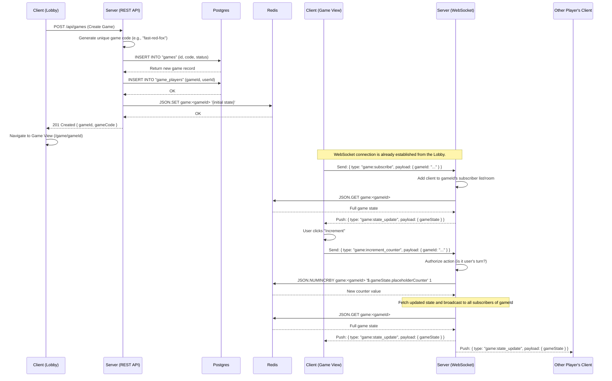

```mermaid
sequenceDiagram
    participant C as Client (Lobby)
    participant S_API as Server (REST API)
    participant DB as Postgres
    participant R as Redis

    C->>S_API: POST /api/games (Create Game)
    S_API->>S_API: Generate unique game code (e.g., "fast-red-fox")
    S_API->>DB: INSERT INTO "games" (id, code, status)
    DB-->>S_API: Return new game record
    S_API->>DB: INSERT INTO "game_players" (gameId, userId)
    DB-->>S_API: OK
    S_API->>R: JSON.SET game:<gameId> '{initial state}'
    R-->>S_API: OK
    S_API-->>C: 201 Created { gameId, gameCode }
    
    C->>C: Navigate to Game View (/game/gameId)

    participant C_Game as Client (Game View)
    participant S_WS as Server (WebSocket)

    Note over C_Game, S_WS: WebSocket connection is already established from the Lobby.

    C_Game->>S_WS: Send: { type: "game:subscribe", payload: { gameId: "..." } }
    S_WS->>S_WS: Add client to gameId's subscriber list/room
    S_WS->>R: JSON.GET game:<gameId>
    R-->>S_WS: Full game state
    S_WS-->>C_Game: Push: { type: "game:state_update", payload: { gameState } }

    C_Game->>C_Game: User clicks "Increment"
    C_Game->>S_WS: Send: { type: "game:increment_counter", payload: { gameId: "..." } }
    S_WS->>S_WS: Authorize action (is it user's turn?)
    S_WS->>R: JSON.NUMINCRBY game:<gameId> '$.gameState.placeholderCounter' 1
    R-->>S_WS: New counter value
    
    Note over S_WS: Fetch updated state and broadcast to all subscribers of gameId
    S_WS->>R: JSON.GET game:<gameId>
    R-->>S_WS: Full game state
    S_WS-->>C_Game: Push: { type: "game:state_update", payload: { gameState } }
    participant OtherPlayer as Other Player's Client
    S_WS-->>OtherPlayer: Push: { type: "game:state_update", payload: { gameState } }
``` 