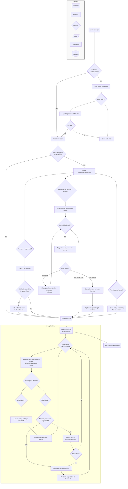

```mermaid
flowchart TD
    subgraph Legend
        direction LR
        L_Start("Start/End")
        L_Process["Process"]
        L_Decision{"Decision"}
        L_Input[/Input/]
        L_Sub[Subroutine]
        L_DB[("Database")]
    end

    Start("User visits app") --> A{"Is there a<br/>valid session?"}
    A -->|No| B["User enters username"]
    B --> C{"Click 'Sign In'"}
    A -->|Yes| I["Session loaded"]

    C --> D["Login/Register User API call"]
    D --> E{"Success?"}
    E -->|No| F["Show auth error"] --> C
    E -->|Yes| I

    I --> J{"Browser supports<br/>notifications?"}
    J -->|No| M("Proceed to app")

    J -->|Yes| K["Check Notification.permission"]
    K --> K_Granted{"Permission is 'granted'?"}
    K --> K_Default{"Permission is 'prompt' / 'default'?"}
    K --> K_Denied{"Permission is 'denied'?"}

    K_Granted --> L["Check in-app setting"]
    L --> L_Enabled{"Notifications enabled<br/>in app settings?"}
    L_Enabled -->|No| L_AutoSub["Auto-subscribe user<br/>via Push Service"] --> M
    L_Enabled -->|Yes| M

    K_Default --> N["Show 'Enable Notifications' dialog"]
    N --> N_Choice{"User clicks 'Enable'?"}
    N_Choice -->|No, clicks 'Skip'| M
    N_Choice --> |Yes| O["Trigger browser permission prompt"]
    O --> O_Choice{"User allows?"}
    O_Choice -->|No, denies| P["Show 'permission denied' message<br/>in dialog"] --> N_Choice
    O_Choice -->|Yes, allows| Q["Subscribe user via Push Service"]
    Q --> R["Update in-app setting to 'enabled'"] --> M
    
    K_Denied --> S["Show dialog explaining<br/>how to unblock"]
    S --> M

    M --> App("User is in the App<br/>(Lobby/Game)")
    
    subgraph "In-App Settings"
        App --> T{"User opens<br/>Game Settings"}
        T --> U["Display checkbox based on<br/>in-app 'notificationsEnabled' setting"]
        U --> V{"User toggles checkbox"}
        V --> V_To_On{"To 'Enabled'?"}
        V --> V_To_Off{"To 'Disabled'?"}

        V_To_On --> W{"Browser permission<br/>is 'granted'?"}
        W --> |No| X["Trigger browser<br/>permission prompt"] --> Y{"User Allows?"}
        Y --> |No| T
        W --> |Yes| Z
        Y --> |Yes| Z["Subscribe via Push Service"]
        Z --> AA["Update in-app setting to 'enabled'"] --> T
        
        V_To_Off --> BB["Update in-app setting to 'disabled'"]
        BB --> CC["Unsubscribe via Push Service"] --> T
    end

    App --> End("User interacts with games")
    
    style Legend fill:#f9f9f9,stroke:#333,stroke-width:2px
```